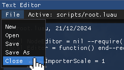

# PhoenixEngine

*✨ garbaj spaghett ✨*

Personal 3D OpenGL "Game Engine" written in C++, that can:
* Load, Save and Render Scenes
    * Multiple objects with materials (Color, Metallic-Roughness, Emission and Normal maps), other parameters and GPU instancing
* Import simple Models (`.gltf`/`.glb`)
* Execute [*Luau*](https://github.com/luau-lang/luau/) scripts with a per-frame event system
* Do simple physics (dynamics and collisions w/ friction with AABBs, also has Raycasting for Scripts)
* Do some simple, color-only post-processing (really weird Bloom, but a kinda nice blur vignette)

Intended to be compatible with both Windows and Linux/Ubuntu.

# Building

* Minimum CMake version of `3.28` (arbitrary, the one I use on Linux. I use `3.30` on Windows)
* Compiler which supports C++ Standard `20` and C Standard `17` (G++/MSVC are intentionally supported)
* For Windows, Visual Studio 2022 platform toolset `v143`
* **Last commit with verified Windows compatibility: `49f2ef282796c9cb10453b6c4ff2cc5e1da91df2`** - Because I mainly use the Linux portion of my dualboot setup, I am not able to frequently verify that I haven't accidentally introduced incompatibilities with Windows/MSVC. The prior commit is the last one which I verified to compile on Visual Studio

1. `git clone https://github.com/PhoenixWhitefire/PhoenixEngine --recursive --depth=1`, or just use the `Code <>` button
    * `--recursive` clones submodules as well (check the `Vendor` directory)
    * `--depth 1` causes only the current commit to be fetched, reducing download times
2. Download the [FMOD Sound Engine](https://fmod.com/download#fmodengine) (personally I've used `2.03.08`), move the extracted folder into the `Vendor` directory and rename it to `FMOD`
3. `cmake -B "./"` in the root directory
    * On Linux/with Ninja, I use `cmake -B "./" -G "Ninja Multi-Config"` specifically
    * When using Visual Studio Code, set the Generator to "Ninja Multi-Config", and change the "Build Directory" setting to just `${workspaceFolder}`
    
4. Open the resulting project in your IDE of choice
5. Build with `cmake --build . --config <CONFIG>` or equivalent in your IDE, with `CONFIG` being one of:
	* `Debug`: Standard Debug build, no optimizations, Address Sanitizer and Tracy
	* `Release`: All optimizations, including Link-Time/Whole-Program optimization, no Address Sanitizer or Tracy
	* `RelTracy`: Same as `Release`, but with Tracy instrumentation enabled, which carries it's own overhead
6. Run.

6. (Optional) I have not configured the Tracy Profiler standalone application to build along with the rest of the Engine, you will need to build it manually. The "Start Profiling" button in the Info widget, as well as the `-tracyim` launch argument, all assume you have built the Profiler yourself and that it is in the expected directory. You can do this with the following commands:
    * `cd Vendor/tracy/profiler`
    * `cmake -B build -G Ninja` (You can omit `-G Ninja` if you're OK with it using Make or whatever CMake decides is appropriate by default)
    * `cmake --build build --config Release`
    
    By the end, you should have a binary at the location `Vendor/tracy/profiler/build/tracy-profiler`.

# Attributions

All 3rd-party code and submodules are located in the `Vendor` directory.

The following third-party projects were used/referenced during this Engine's development:

* Luau - [@Roblox/Luau](https://github.com/Roblox/Luau/)
* Lute - [@luau-lang/lute](https://github.com/luau-lang/lute)
* SDL3 - [libsdl.org](https://libsdl.org/)
* OpenGL - [Khronos Group](https://khronos.org/)
* Glad - [glad.dav1d.de/](https://glad.dav1d.de/)
* GLM - [@g-truc/glm](https://github.com/g-truc/glm/)
* `nlohmann::json` - [@nlohmann/json](https://github.com/nlohmann/json/)
* Dear ImGui - [@ocornut/ImGui](https://github.com/ocornut/imgui/)
* STB Image - [@nothings/stb](https://github.com/nothings/stb)
* Tracy - [@wolfpld/Tracy](https://github.com/wolfpld/tracy)
* FMOD Core - [fmod.com](https://fmod.com)

The [OpenGL YouTube tutorials](https://youtube.com/watch?v=XpBGwZNyUh0&list=PLPaoO-vpZnumdcb4tZc4x5Q-v7CkrQ6M-) of [Victor Gordan](https://github.com/VictorGordan/) (who I occasionally make fun of in the code comments) were referenced heavily during the creation of the rendering systems of this engine.
Initially, this started out as a 1-to-1 follow-along of what he did, but I rewrote the entire thing to work in a better "Game Engine"-style architecture, as the tutorial had a simpler Model Viewer architecture that was not suitable for a Game Engine.

Additionally, I referred to ["Dave Poo"'s C++ Lua embedding tutorials](https://www.youtube.com/watch?v=xrLQ0OXfjaI&list=PLLwK93hM93Z3nhfJyRRWGRXHaXgNX0Itk) while adding the Luau scripting capabilities.

End of README.

